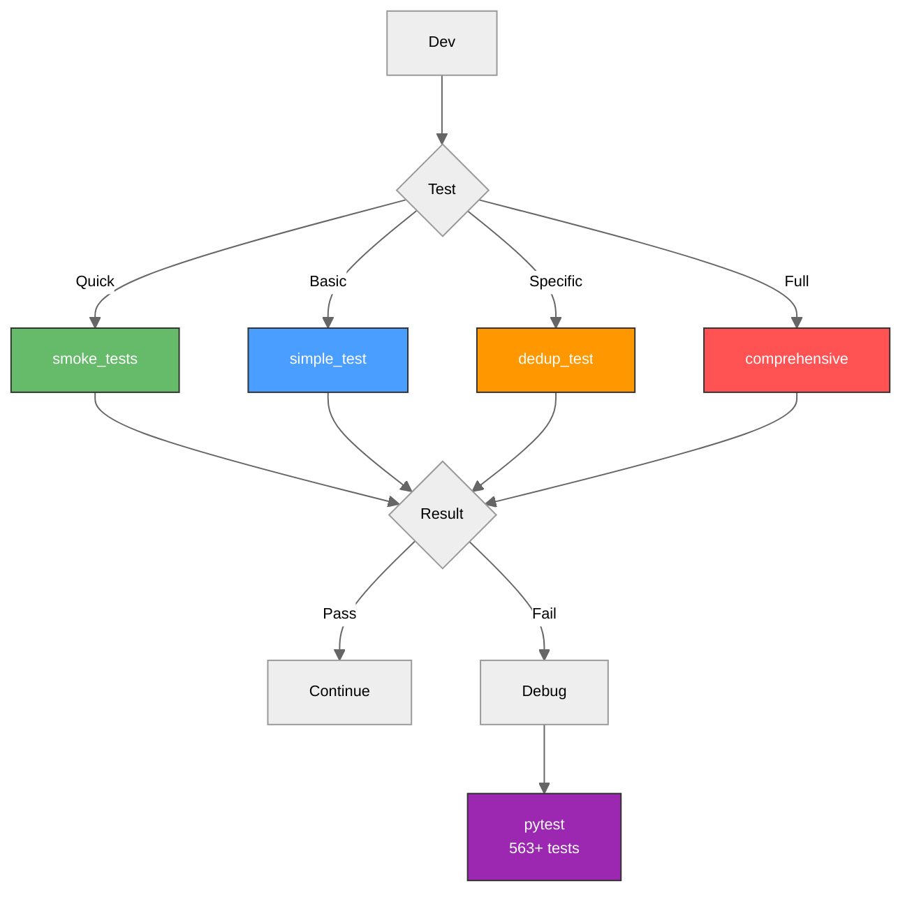
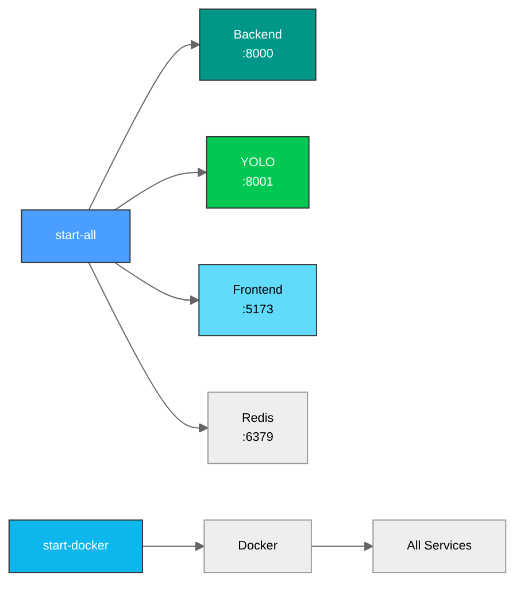

# Scripts de Utilidad - Sentrix

Scripts para desarrollo, testing, deployment y mantenimiento del proyecto Sentrix.

## Arquitectura

### Flujo de Testing



### Scripts de Inicio



## Estructura

```
scripts/
├── README.md                      # Este archivo
│
├── Inicio de Servicios (Windows PowerShell)
├── start-all.ps1                  # Iniciar todos los servicios en desarrollo
├── start-docker.ps1               # Iniciar con Docker Compose
│
├── Inicio de Servicios (Linux/Mac Bash)
├── start-backend-dev.sh           # Iniciar backend en modo desarrollo
├── start-celery-worker.sh         # Iniciar Celery worker
├── start-flower.sh                # Iniciar Flower (monitor de Celery)
│
├── Testing y Validación
├── simple_test.py                 # Tests básicos de funcionalidad
├── quick_smoke_tests.py           # Smoke tests de componentes críticos
├── test_deduplication.py          # Tests del sistema de deduplicación
├── integration-test.py            # Tests de integración entre servicios
├── run_comprehensive_tests.py     # Runner completo de todos los tests
│
├── Utilidades de Desarrollo
├── run-tests.sh                   # Script para ejecutar tests con pytest
├── show-status.sh                 # Mostrar estado de servicios y git
│
├── Instalación y Setup
├── install-all.ps1                # Instalar dependencias (Windows)
├── install-all.sh                 # Instalar dependencias (Linux/Mac)
│
├── setup/                         # Scripts de configuración inicial
│   ├── init-db.sql               # Inicialización de base de datos
│   └── setup-env.py              # Configuración de entorno
│
└── maintenance/                   # Scripts de mantenimiento
    ├── comprehensive_fix_imports.py  # Corrección de imports
    ├── fix_api_routers.py           # Corrección de routers API
    ├── fix_entry_points.py          # Corrección de entry points
    └── fix_imports.py               # Corrección de imports legacy
```

## Scripts de Inicio

### Windows PowerShell

#### `start-all.ps1`
Inicia todos los servicios del proyecto en desarrollo local (backend, YOLO service, frontend).

```powershell
# Windows
.\scripts\start-all.ps1
```

**Inicia:**
- Backend API (puerto 8000)
- YOLO Service (puerto 8001)
- Frontend (puerto 5173)
- Redis (si está instalado)

#### `start-docker.ps1`
Inicia el proyecto usando Docker Compose.

```powershell
# Windows
.\scripts\start-docker.ps1
```

**Levanta:**
- Todos los servicios en contenedores
- PostgreSQL
- Redis
- Backend + YOLO + Frontend

### Linux/Mac Bash

#### `start-backend-dev.sh`
Inicia solo el backend API en modo desarrollo.

```bash
chmod +x scripts/start-backend-dev.sh
./scripts/start-backend-dev.sh
```

#### `start-celery-worker.sh`
Inicia un worker de Celery para procesamiento asíncrono.

```bash
chmod +x scripts/start-celery-worker.sh
./scripts/start-celery-worker.sh
```

#### `start-flower.sh`
Inicia Flower (interfaz web para monitorear Celery).

```bash
chmod +x scripts/start-flower.sh
./scripts/start-flower.sh
```

**Acceso:** http://localhost:5555

## Scripts de Testing

### `simple_test.py`
Tests básicos de funcionalidad del sistema.

```bash
python scripts/simple_test.py
```

**Verifica:**
- Importación de `sentrix_shared` library
- Nomenclatura estandarizada
- AnalysisService
- SupabaseManager
- Enums y modelos de datos

### `quick_smoke_tests.py`
Verificación rápida de componentes críticos del sistema.

```bash
python scripts/quick_smoke_tests.py
```

**Prueba:**
- Importación de módulos críticos (`sentrix_shared`, backend, yolo-service)
- Generación de nombres estandarizados
- Detección de formatos de imagen
- Clientes (Supabase, YOLO, Analysis)
- Risk assessment algorithms
- Configuración y settings

### `test_deduplication.py`
Tests del sistema de deduplicación.

```bash
python scripts/test_deduplication.py
```

**Valida:**
- Firmas de contenido (SHA-256, MD5)
- Detección de duplicados
- Scoring de similitud
- Ahorro de storage

### `integration-test.py`
Tests de integración entre servicios.

```bash
python scripts/integration-test.py
```

### `run_comprehensive_tests.py`
Runner completo de todos los tests.

```bash
python scripts/run_comprehensive_tests.py
```

## Utilidades de Desarrollo

### `run-tests.sh`
Script bash para ejecutar tests con pytest de forma rápida.

```bash
chmod +x scripts/run-tests.sh
./scripts/run-tests.sh
```

**Funcionalidad:**
- Ejecuta pytest en backend con opciones optimizadas
- Genera reportes de cobertura
- Útil para CI/CD

### `show-status.sh`
Muestra el estado actual del proyecto y servicios.

```bash
chmod +x scripts/show-status.sh
./scripts/show-status.sh
```

**Muestra:**
- Estado de git (branch, commits, cambios)
- Procesos corriendo (backend, YOLO, frontend)
- Puertos en uso
- Versión de Python y Node.js
- Estado de dependencias

## Flujo de Testing Recomendado

```bash
# 1. Smoke tests (verificación rápida)
python scripts/quick_smoke_tests.py

# 2. Tests básicos
python scripts/simple_test.py

# 3. Tests de deduplicación
python scripts/test_deduplication.py

# 4. Tests completos
python scripts/run_comprehensive_tests.py
```

## Relación con Suite de Tests del Backend

Estos scripts son complementarios a la suite principal de tests en `backend/tests/`:

| Scripts (Smoke Tests) | Backend Tests (Suite Completa) |
|----------------------|-------------------------------|
| `simple_test.py` | 563+ tests en `backend/tests/` |
| `quick_smoke_tests.py` | Tests unitarios, integración y performance |
| `test_deduplication.py` | Coverage 69-91% en módulos críticos |
| `integration-test.py` | pytest con fixtures y mocking completo |

**Cuándo usar cada uno:**
- **Scripts**: Verificación rápida durante desarrollo, debugging, smoke tests
- **pytest (backend/tests/)**: Testing exhaustivo, CI/CD, validación pre-commit

## Notas Importantes

- Todos los scripts usan `sentrix_shared` (no `shared` legacy)
- `.env` centralizado en raíz del proyecto (no en subdirectorios)
- Scripts bash requieren permisos de ejecución (`chmod +x`)
- Scripts PowerShell pueden requerir `Set-ExecutionPolicy RemoteSigned`
- Para tests de producción, usar siempre `pytest` en `backend/tests/`
- Configuración Docker está en: `docker/docker-compose.yml`

## Documentación Relacionada

- **[Backend Tests](../backend/tests/)**: Suite completa de 563+ tests
- **[Backend README](../backend/README.md)**: Documentación de API y testing
- **[Root README](../README.md)**: Visión general del proyecto

---

**Versión**: 2.7.1 | **Última actualización**: Noviembre 2025
