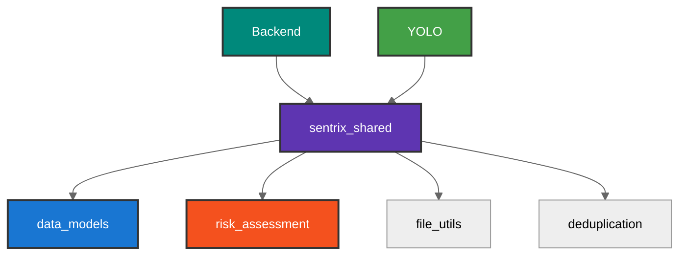

# Sentrix Shared Library


Librería Python `sentrix_shared` con código compartido entre backend y yolo-service. Centraliza enums, evaluación de riesgo, utilidades y validaciones.

---

## Quick Start

```bash
cd shared
pip install -e .
```

```python
# Usar en backend o yolo-service
from sentrix_shared.data_models import DetectionRiskEnum, BreedingSiteTypeEnum
from sentrix_shared.risk_assessment import assess_dengue_risk
from sentrix_shared.file_utils import generate_standardized_filename
```

---

## Estructura

```
shared/
├── sentrix_shared/              # Código fuente del paquete
│   ├── __init__.py             # Inicialización del paquete
│   ├── data_models.py          # Enums y modelos de datos compartidos
│   ├── risk_assessment.py      # Evaluación de riesgo de dengue
│   ├── file_utils.py           # Utilidades de archivos y nomenclatura
│   ├── gps_utils.py            # Extracción de GPS desde EXIF
│   ├── image_deduplication.py  # Sistema de deduplicación de imágenes
│   ├── image_formats.py        # Conversión de formatos de imagen
│   ├── error_handling.py       # Manejo centralizado de errores
│   ├── logging_utils.py        # Utilidades de logging
│   ├── config_manager.py       # Gestión de configuración
│   ├── temporal_persistence.py # Persistencia temporal
│   ├── project_structure.py    # Información de estructura del proyecto
│   └── import_utils.py         # Utilidades de importación
│
├── tests/                      # Tests unitarios
├── pyproject.toml             # Configuración del paquete (PEP 621)
├── requirements.txt           # Dependencias
├── MANIFEST.in               # Archivos a incluir en distribución
└── README.md                 # Este archivo
```

---

## Arquitectura

<div align="center">



</div>

---

## Componentes Principales

### 1. Enums Unificados (data_models.py)

```python
from sentrix_shared.data_models import (
    DetectionRiskEnum,        # ALTO, MEDIO, BAJO, MINIMO
    BreedingSiteTypeEnum,     # BASURA, CALLES_MAL_HECHAS, CHARCOS, HUECOS
    AnalysisStatusEnum,       # PENDING, PROCESSING, COMPLETED, FAILED
    ValidationStatusEnum,     # PENDING_VALIDATION, VALIDATED_POSITIVE, etc.
    UserRoleEnum,            # USER, ADMIN, EXPERT
    LocationSourceEnum       # EXIF_GPS, MANUAL, ESTIMATED
)
```

### 2. Evaluación de Riesgo (risk_assessment.py)

```python
from sentrix_shared.risk_assessment import assess_dengue_risk

detections = [
    {"class": "Charcos/Cumulo de agua", "confidence": 0.85},
    {"class": "Basura", "confidence": 0.75}
]

risk = assess_dengue_risk(detections)
# Returns: {
#   'overall_risk_level': 'ALTO',
#   'risk_distribution': {...},
#   'total_detections': 2,
#   'high_risk_sites': 2
# }
```

**Algoritmo:**
- 3+ criaderos alto riesgo → ALTO
- 1 alto + 3 medio → ALTO
- 1-2 alto → MEDIO
- 3+ medio → MEDIO
- 1-2 medio → BAJO
- Sin detecciones → MÍNIMO

### 3. Nomenclatura Estandarizada (file_utils.py)

```python
from sentrix_shared.file_utils import generate_standardized_filename

filename = generate_standardized_filename(
    original_filename="IMG_1234.jpg",
    camera_info={"camera_make": "Apple", "camera_model": "iPhone 15"},
    gps_data={"latitude": -34.603722, "longitude": -58.381592},
    analysis_timestamp=datetime.now()
)
# Result: SENTRIX_20250926_143052_IPHONE15_LATn34p604_LONn58p382_a1b2c3d4.jpg
```

### 4. Sistema de Deduplicación (image_deduplication.py)

```python
from sentrix_shared.image_deduplication import (
    check_image_duplicate,
    calculate_content_signature
)

# Calcular firma
signature = calculate_content_signature(image_data)
# {'sha256': 'abc123...', 'md5': 'def456...', 'size_bytes': 1024000}

# Verificar duplicados
duplicate_check = check_image_duplicate(
    image_data=image_data,
    existing_analyses=[...],
    camera_info={"camera_make": "Apple"},
    gps_data={"latitude": -34.603, "longitude": -58.381}
)
# {'is_duplicate': True/False, 'duplicate_analysis_id': 'uuid', 'confidence': 0.85}
```

### 5. Formatos de Imagen (image_formats.py)

```python
from sentrix_shared.image_formats import (
    ImageFormatConverter,
    is_format_supported,
    SUPPORTED_IMAGE_FORMATS
)

# Verificar soporte
if is_format_supported('.heic'):
    converter = ImageFormatConverter()
    result = converter.convert_heic_to_jpeg("photo.heic", "photo.jpg")
```

**Formatos soportados:**
- JPEG, PNG, HEIC, TIFF, WebP, BMP

---

## Módulos Detallados

### data_models.py
Enums y constantes compartidas entre servicios.

**Exports:**
- `DetectionRiskEnum` - Niveles de riesgo
- `BreedingSiteTypeEnum` - Tipos de criaderos
- `AnalysisStatusEnum` - Estados de análisis
- `ValidationStatusEnum` - Estados de validación
- `UserRoleEnum` - Roles de usuario
- `LocationSourceEnum` - Fuentes de ubicación
- Mapeos de clases YOLO a tipos de criaderos

### risk_assessment.py
Evaluación inteligente de riesgo basada en detecciones.

**Función principal:**
- `assess_dengue_risk(detections)` - Evalúa riesgo general

### file_utils.py
Utilidades para manejo de archivos e imágenes.

**Funciones:**
- `generate_standardized_filename()` - Nombres estandarizados con metadata
- `validate_image_file()` - Validación de archivos de imagen
- `get_file_hash()` - Cálculo de hash de archivos

### gps_utils.py
Extracción de coordenadas GPS desde metadata EXIF.

**Funciones:**
- `extract_image_gps()` - Extrae GPS de imagen
- `parse_gps_coordinates()` - Parseo de coordenadas
- `validate_gps_coordinates()` - Validación de coordenadas

### image_deduplication.py
Sistema de detección de imágenes duplicadas.

**Funciones:**
- `check_image_duplicate()` - Verifica si imagen es duplicada
- `calculate_content_signature()` - Calcula firma de contenido
- `find_similar_images()` - Búsqueda de imágenes similares

### image_formats.py
Conversión entre formatos de imagen.

**Clase principal:**
- `ImageFormatConverter` - Convertidor de formatos
- Soporte HEIC, JPEG, PNG, TIFF, WebP, BMP

### error_handling.py
Manejo centralizado de errores y excepciones.

**Clases:**
- Excepciones personalizadas
- Handlers de errores comunes

### logging_utils.py
Configuración y utilidades de logging.

**Funciones:**
- Configuración de loggers
- Formatters personalizados

### config_manager.py
Gestión centralizada de configuración.

**Clase:**
- `ConfigManager` - Gestión de configuración compartida

---

## Mapeos

```python
from sentrix_shared.data_models import (
    CLASS_ID_TO_BREEDING_SITE,     # {0: BASURA, 1: CALLES_MAL_HECHAS, ...}
    BREEDING_SITE_TO_CLASS_ID,     # Mapeo inverso
    HIGH_RISK_CLASSES,             # [BASURA, CHARCOS]
    MEDIUM_RISK_CLASSES            # [HUECOS, CALLES_MAL_HECHAS]
)
```

---

## Uso por Servicio

### Backend
```python
from sentrix_shared.data_models import ValidationStatusEnum, UserRoleEnum
from sentrix_shared.file_utils import validate_image_file
from sentrix_shared.file_utils import generate_standardized_filename
from sentrix_shared.image_deduplication import check_image_duplicate
from sentrix_shared.risk_assessment import assess_dengue_risk
```

### YOLO Service
```python
from sentrix_shared.data_models import DetectionRiskEnum, CLASS_ID_TO_BREEDING_SITE
from sentrix_shared.risk_assessment import assess_dengue_risk
from sentrix_shared.image_formats import ImageFormatConverter
from sentrix_shared.gps_utils import extract_image_gps
```

---

## Testing

```bash
cd shared
python -m pytest tests/ -v

# Test de importación
python -c "from sentrix_shared.data_models import DetectionRiskEnum; print('OK')"
```

---

## Documentación

- [README Principal](../README.md)
- [Backend](../backend/README.md)
- [YOLO Service](../yolo-service/README.md)

---

**Versión:** 2.7.1 | **Python**: 3.8+ | **Actualizado**: Noviembre 2025
