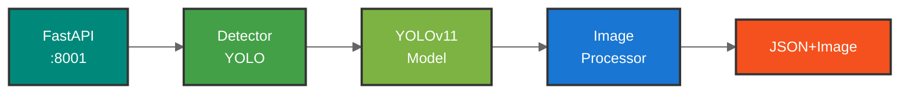
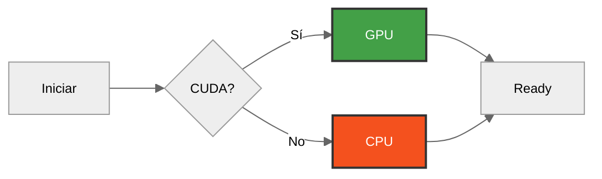

# YOLO Service - Servicio de Detección IA


Servicio especializado de detección con YOLOv11 para identificación de criaderos de *Aedes aegypti* mediante instance segmentation.

---

## Quick Start

```bash
cd yolo-service
python -m venv venv
source venv/bin/activate  # Windows: venv\Scripts\activate
pip install -r requirements.txt

python server.py
```

**Acceso**: http://localhost:8001/docs

---

## Arquitectura

<div align="center">



</div>

---

## Estructura

```
yolo-service/
├── server.py                # Servidor FastAPI principal
├── main.py                  # CLI para detección
├── train_simple.py          # Script de entrenamiento estándar
├── requirements.txt         # Dependencias Python
├── Dockerfile              # Imagen Docker
│
├── src/                    # Código fuente
│   ├── core/              # Lógica core de detección
│   │   └── detector.py    # Motor YOLO
│   ├── utils/             # Utilidades
│   │   └── file_ops.py    # Operaciones de archivos
│   └── reports/           # Generación de reportes
│
├── configs/               # Configuraciones YOLO
│   └── data.yaml         # Configuración de dataset
│
├── scripts/              # Scripts de desarrollo
│   ├── training/        # Entrenamiento avanzado y análisis
│   │   ├── analyze_dataset.py
│   │   ├── train_optimized.py
│   │   └── evaluate_final.py
│   ├── diagnostics/     # Diagnóstico del sistema
│   │   └── diagnostic.py
│   └── testing/         # Testing y utilidades
│       ├── test_new_model.py
│       └── utils.py
│
├── models/              # Modelos YOLO (gitignored)
│   ├── best.pt         # Modelo entrenado
│   └── yolo11*-seg.pt  # Modelos base
│
├── data/               # Dataset (gitignored)
│   ├── images/        # Imágenes de entrenamiento
│   └── labels/        # Anotaciones YOLO
│
├── tests/             # Tests unitarios
├── test_images/       # Imágenes de prueba
├── logs/              # Logs del servicio (gitignored)
├── runs/              # Outputs de entrenamiento (gitignored)
└── results/           # Resultados de detección (gitignored)
```

---

## Características

### Detección con YOLOv11
- **Instance Segmentation**: Máscaras a nivel pixel
- **4 Tipos de Criaderos**: Charcos, basura, huecos, calles mal hechas
- **Confianza Configurable**: Umbral ajustable (default: 0.5)
- **Múltiples Formatos**: JPEG, PNG, HEIC, TIFF, WebP, BMP

### Procesamiento
- **Imagen Procesada**: Genera imagen con marcadores de color
- **Polígonos Precisos**: Contornos siguiendo boundaries exactos
- **Etiquetas Informativas**: Clase + confianza por detección
- **Colores Diferenciados**: Color único por tipo de criadero

### Modelos
- **Auto-detección**: Usa el modelo más reciente automáticamente
- **Soporte Multi-modelo**: YOLOv11n/s/m/l/x-seg
- **Entrenamiento**: Scripts incluidos para modelos personalizados

### Performance
- **GPU Accelerated**: Soporte CUDA automático
- **Batch Processing**: Procesamiento por lotes
- **Device Selection**: Auto, CUDA o CPU
- **< 1s por imagen** en GPU

---

## API Endpoints

### Health Check
```bash
GET /health

Response:
{
  "status": "healthy",
  "model_path": "models/best.pt",
  "device": "cuda",
  "yolo_version": "11.0.0"
}
```

### Detección
```bash
POST /detect
Content-Type: multipart/form-data

Form Data:
- file: imagen (required)
- confidence_threshold: float (opcional, default: 0.5)

Response:
{
  "analysis_id": "uuid",
  "status": "completed",
  "detections": [
    {
      "class_name": "Charcos/Cumulo de agua",
      "confidence": 0.853,
      "risk_level": "ALTO",
      "bounding_box": { "x_min": 100, "y_min": 150, ... },
      "polygon": [[x1,y1], ...],
      "mask_area": 12450.5
    }
  ],
  "risk_assessment": {
    "overall_risk_level": "ALTO",
    "high_risk_count": 2,
    "risk_score": 0.75
  },
  "location": {
    "latitude": -34.603722,
    "longitude": -58.381592,
    "source": "EXIF_GPS"
  },
  "processed_image": {
    "base64": "data:image/jpeg;base64,..."
  },
  "processing_time_ms": 847
}
```

---

## Tipos de Criaderos

| Tipo | Riesgo | Color Marcador |
|------|--------|----------------|
| **Charcos/Agua estancada** | ALTO | Azul (#0064FF) |
| **Basura** | ALTO | Naranja (#FF8C00) |
| **Huecos** | MEDIO | Verde (#00C800) |
| **Calles mal hechas** | MEDIO | Rojo (#FF0000) |

---

## Modelos

### Auto-detección
El servicio detecta automáticamente el modelo más reciente:

**Prioridad:**
1. Variable `YOLO_MODEL_PATH` en .env
2. Último modelo en `models/dengue_seg_*/weights/best.pt` (por fecha)
3. Modelo manual en `models/best.pt`
4. Modelos base `models/yolo11*-seg.pt`

### Modelos Base (Ultralytics)
- `yolo11n-seg.pt` - Nano (6.7MB, más rápido)
- `yolo11s-seg.pt` - Small (24MB, balanceado) [Recomendado]
- `yolo11m-seg.pt` - Medium (49MB, preciso)
- `yolo11l-seg.pt` - Large (77MB, muy preciso)

---

## Entrenamiento

### Script Simplificado

```bash
# Entrenamiento básico (50 épocas)
python train_simple.py --model models/yolo11s-seg.pt --epochs 50 --batch 8

# Entrenamiento extendido
python train_simple.py --epochs 100 --batch 8

# Personalizar nombre
python train_simple.py --epochs 50 --name mi_modelo_dengue
```

**Resultados:**
```
models/dengue_seg_s_50ep_YYYYMMDD/
├── weights/
│   ├── best.pt      # Usar este modelo
│   └── last.pt      # Último checkpoint
└── results.csv      # Métricas
```

### Parámetros

| Parámetro | Descripción | Default |
|-----------|-------------|---------|
| `--model` | Modelo base | `yolo11s-seg.pt` |
| `--epochs` | Épocas | `100` |
| `--batch` | Batch size | `8` |
| `--imgsz` | Tamaño imagen | `640` |

### Métricas Objetivo
- mAP@50 > 0.80 (bueno) / 0.90 (excelente)
- Precision > 0.85
- Recall > 0.80

---

## Hardware y GPU

### Detección Automática



### Configuración Manual

```bash
# Forzar GPU
YOLO_DEVICE=cuda python server.py

# Forzar CPU
YOLO_DEVICE=cpu python server.py

# Auto (default)
YOLO_DEVICE=auto python server.py
```

### Requisitos

**Mínimos:**
- CPU: 2+ cores
- RAM: 4GB
- Disco: 2GB

**Recomendados (GPU):**
- GPU: NVIDIA con CUDA 11.8+
- VRAM: 4GB+
- RAM: 8GB

### Performance

| Hardware | Tiempo/Imagen | Throughput |
|----------|---------------|------------|
| CPU (4 cores) | ~3-5s | 12-20 img/min |
| GPU (RTX 3050) | ~0.5-1s | 60-120 img/min |
| GPU (RTX 4090) | ~0.2-0.4s | 150-300 img/min |

---

## Variables de Entorno

```bash
# Puerto
YOLO_SERVICE_PORT=8001

# Modelo (opcional - auto-detección)
YOLO_MODEL_PATH=models/best.pt
YOLO_CONFIDENCE_THRESHOLD=0.5
YOLO_DEVICE=auto  # auto, cuda, cpu

# Performance
YOLO_BATCH_SIZE=10
YOLO_TIMEOUT_SECONDS=60

# Logging
LOG_LEVEL=INFO
```

---

## Testing

```bash
# Tests unificados
python -m pytest tests/test_unified.py -v

# Tests de detección
python -m pytest tests/test_model_inference.py -v

# Todos los tests
python -m pytest tests/ -v
```

---

## Troubleshooting

### Modelo no encontrado
```bash
# Verificar modelos disponibles
ls -la models/

# Descargar modelo base
python -c "from ultralytics import YOLO; YOLO('yolo11s-seg.pt')"

# Verificar modelo en uso
curl http://localhost:8001/health
```

### CUDA out of memory
```bash
# Reducir batch size
python train_simple.py --batch 4

# Forzar CPU
YOLO_DEVICE=cpu python server.py
```

### Imagen procesada no se genera
```bash
# Verificar permisos de temp/
ls -la temp/

# Verificar logs
tail -f logs/yolo-service.log
```

---

## Scripts de Desarrollo

En la carpeta `scripts/` se encuentran herramientas avanzadas de desarrollo:

### training/
- **analyze_dataset.py** - Análisis comprehensivo del dataset (distribución, calidad, recomendaciones)
- **train_optimized.py** - Entrenamiento avanzado con k-fold cross-validation
- **evaluate_final.py** - Evaluación detallada con métricas por clase y análisis estadístico

### diagnostics/
- **diagnostic.py** - Diagnóstico completo del sistema (hardware, modelos, performance)

### testing/
- **test_new_model.py** - Test rápido de modelos recién entrenados
- **utils.py** - Funciones de utilidad compartidas

Ver [scripts/README.md](scripts/README.md) para documentación detallada y ejemplos de uso.

---

## CLI Usage

```bash
# Detección individual
python main.py detect imagen.jpg

# Detección por lotes
python main.py batch-detect directorio_imagenes/

# Diagnóstico del sistema
python scripts/diagnostics/diagnostic.py

# Análisis de dataset
python scripts/training/analyze_dataset.py
```

---

## Documentación

- [README Principal](../README.md)
- [Backend API](../backend/README.md)
- [Frontend](../frontend/README.md)
- [Ultralytics YOLOv11 Docs](https://docs.ultralytics.com/)

---

**Versión**: 2.7.1 | **Actualizado**: Noviembre 2025
